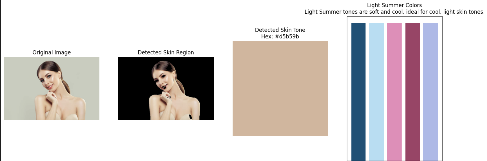
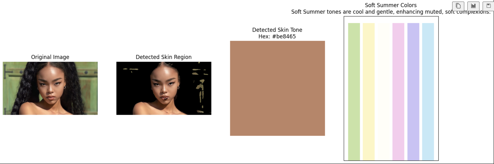

# 🎨 Personal Color Analysis – 12-Season Palette (with OpenCV)

A Python-based Jupyter Notebook that detects a user's **skin tone** from a photo and classifies them into a **K-beauty style 12-season personal color palette** (Spring 🌸, Summer 🌊, Autumn 🍂, Winter ❄️). Built using basic computer vision and color classification techniques, this project helps users discover the colors that suit their natural tone best.

---

## 📚 Overview

This notebook analyzes facial skin tone using OpenCV's skin detection in the YCrCb color space. It extracts the average skin color, converts it to hex, and then classifies it into one of the 12 seasonal palettes. Each result includes:

* A detected skin patch color
* The classified color season
* A color bar of recommended tones
* A short style description based on Korean color theory

---

## ✨ Features

* 🖼️ Image upload & skin region detection
* 🎨 Average skin tone color extraction (RGB + Hex)
* 🔎 Classification into one of 12 seasonal palettes:

  * Bright/Cool/Dark Winter
  * Bright/Warm/Light Spring
  * Light/Cool/Soft Summer
  * Soft/Warm/Dark Autumn
* 🌈 Palette display with recommended tones and style suggestions
* 📊 Visual output: original photo, skin region, tone patch, and palette bar

---

## 🧰 Built With

* Python 3
* OpenCV
* NumPy
* Matplotlib
* Jupyter Notebook

---

## 🚀 How to Run

1. Clone the repo and open the notebook:

   ```bash
   git clone https://github.com/yourusername/personal-color-analysis.git
   cd personal-color-analysis
   jupyter notebook
   ```

2. In the notebook, change the `image_path` to your own image:

   ```python
   image_path = 'your_photo.jpg'
   analyze_skin_tone_and_recommend_palette(image_path)
   ```

> 📸 Use a natural light, makeup-free, front-facing photo for best results.

## 🎨 Sample Output

The notebook shows four panels:

1. Original uploaded image
2. Detected skin region
3. Detected skin tone swatch + hex value
4. Recommended palette bar with description

Result 1:
This subject was classified as Light Summer, with a soft peach-beige skin tone (#d5b59b). Her complexion reflects cool, light characteristics, making pastel shades with a hint of blue or pink the most flattering. The recommended palette focuses on cool and delicate tones that enhance her softness without overwhelming contrast.

 

Result 2:
A deeper, warm-toned subject was also classified as Soft Summer, with a more coppery-tan tone (#be8465). Despite the difference in depth, the muted undertones aligned with the Soft Summer category, suggesting pastel cool shades work beautifully across varying skin depths.

 

---

## ⚠️ Disclaimer

This tool is for fun and educational purposes only and should not replace professional personal color consulting. Accuracy may vary depending on lighting and image quality.

---
